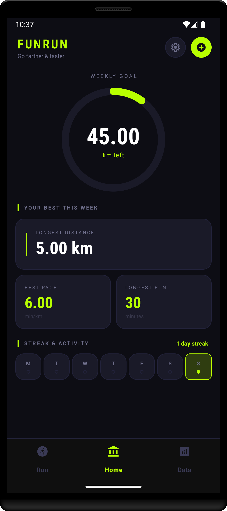
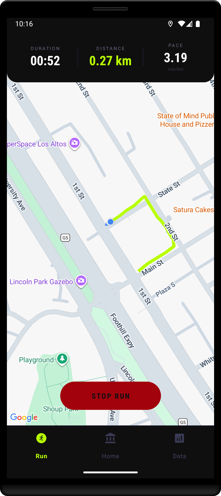
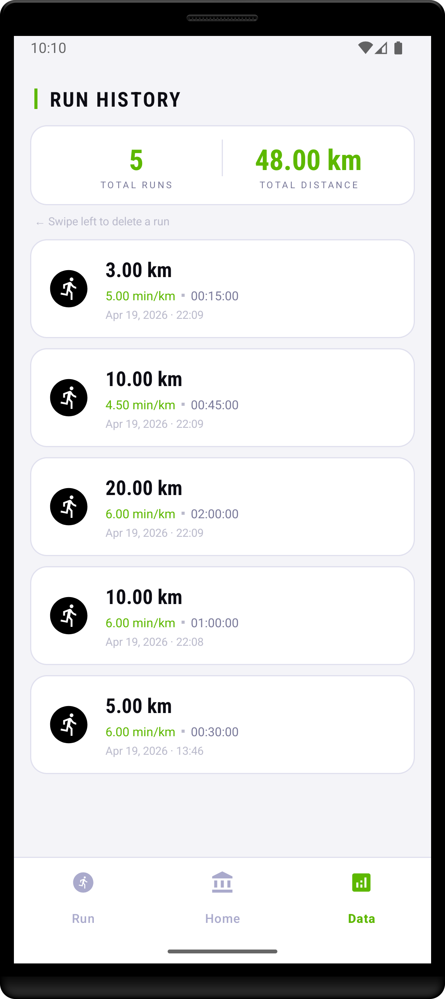
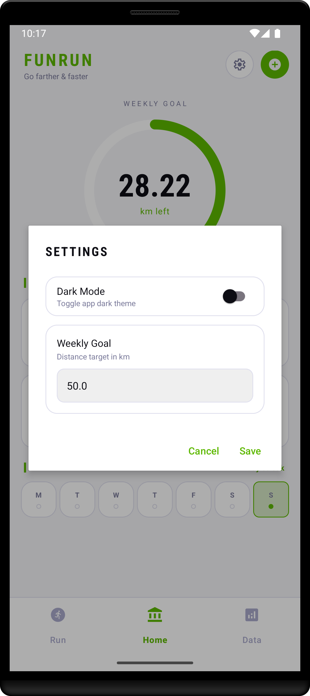

# FunRun 


An Android run-tracking application built with Kotlin. FunRun uses real-time GPS to track runs, visualizes weekly progress, and stores the complete run history locally in a Room database.

---


## Screenshots

<p float="left">
  
  
  
  
</p>

---

## Features

### Real-Time GPS Tracking
- Continuous location updates using the **Fused Location Provider API**
- Live route drawing on Google Maps with polylines
- Accurate distance calculation from GPS coordinates with noise filtering (rejects readings with accuracy > 20 m and movements < 1 m)


### Home Dashboard
- Circular progress ring for the weekly goal showing **remaining km**
- Best results from the last 7 days: longest distance, best pace, longest run duration
- **Streak tracker** — counts consecutive days with at least one run
- **Weekly activity calendar** — Mon–Sun strip with a dot on days with a run and today highlighted

### Run History
- Complete list of runs sorted from newest, with distance, pace, duration, and date
- **Swipe left to delete** any run with an animated red background
- Total number of runs and total distance displayed at the top


### Settings
- Toggle between **dark and light mode** — persisted across sessions with SharedPreferences
- Set a custom **weekly distance goal** in km

---

## Tech Stack

| Layer | Technology |
|---|---|
| Language | Kotlin |
| UI | XML layouts, View Binding, Material 3 |
| Navigation | Fragment Manager + bottom navigation bar |
| Maps | Google Maps SDK, Fused Location Provider |
| Database | **Room (SQLite)** with KSP annotation processing |
| Preferences | SharedPreferences |
| Architecture | Single activity, multiple fragments |
| Build | Gradle with KSP |

---


## Getting Started (Developers)

### Installation

1. Clone the repository:
```bash
   git clone https://github.com/stanojab/FunRun.git
```

2. Add your Google Maps API key in `local.properties`:
```
MAPS_API_KEY=your_api_key
```
3. Sync Gradle and run on a physical device or emulator.

---
